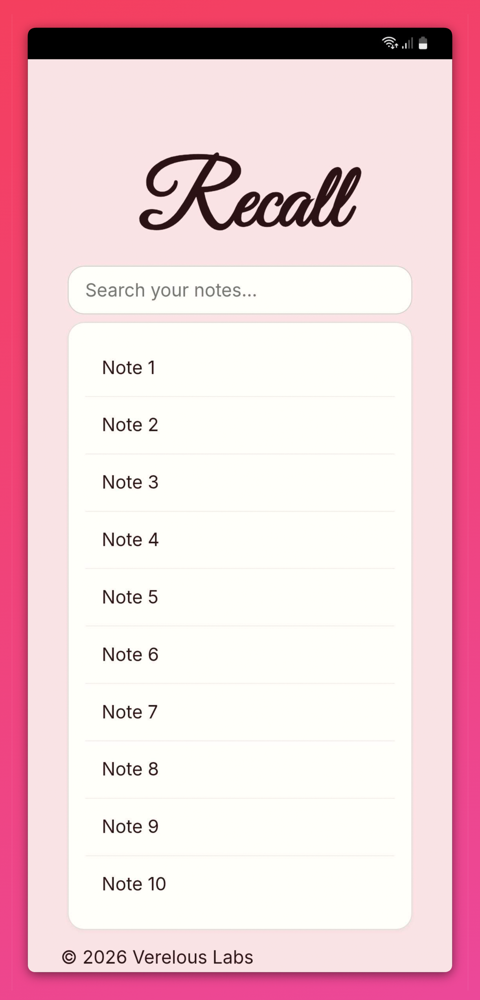
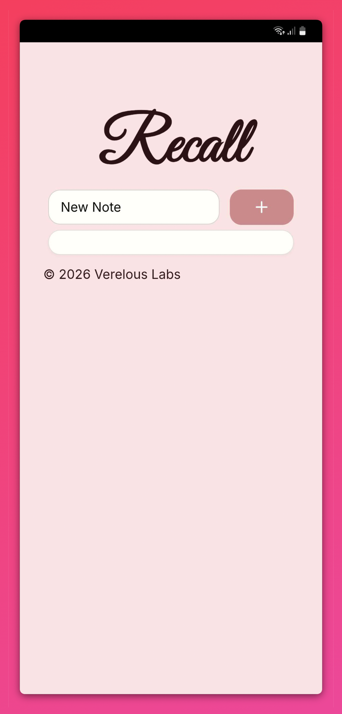
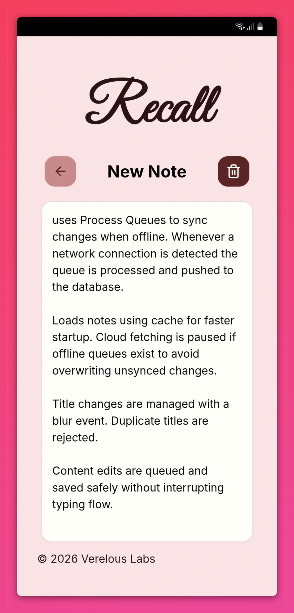

# Recall

Recall was built using Create React App and extended into a full-stack application using Supabase for authentication and database functionality.

> **Install:** [https://get-recall.vercel.app/](https://get-recall.vercel.app/)

## What it is
Recall is a minimal, search-first note-taking app for catching thoughts before they slip away — especially the ones you get mid-scroll, mid-research, or mid-rabbit-hole, right when you're least likely to actually stop and write them down.

## Preview

  
  
  

## Why I built it
I kept losing good ideas the same way: reading something, thinking "I should write that down," and then either forgetting by the time I found the right app, or getting derailed by folders and menus before I'd typed a single word.

Recall's whole design is built around removing that gap. There's one search bar. You type, and either an existing note opens instantly, or — if nothing matches — the option to create one shows up right there, in the same place. No new screen, no decision about where it goes.

Notes aren't meant to be "finished" either. The idea is you come back to them, add to them, and let them grow as you keep digging into whatever pulled you in the first place.

## How it works
**Search *is* the interface** — there's no separate "create note" flow:
- Typing in the search bar queries your existing notes as you go
- No match? A create button shows up right there, still in the search view
- Opening a note drops you into a focused editing view, and it saves automatically when you leave — no save button to think about

## Features
- **Search-first** — one input handles both finding and creating notes
- **Instant creation** — no menus, no navigation, notes are just *there*
- **Living notes** — built to be added to, not written once and left alone
- **Minimal UI** — designed to get out of the way so you can capture the thought and move on

## Built with
- **Frontend:** React
- **Styling:** CSS3
- **Auth & Database:** Supabase

## Author
Built by [9musa](https://github.com/9musa), under Verelous Labs.

## License
Recall is licensed under the MIT License - see the [LICENSE](LICENSE) file for details.